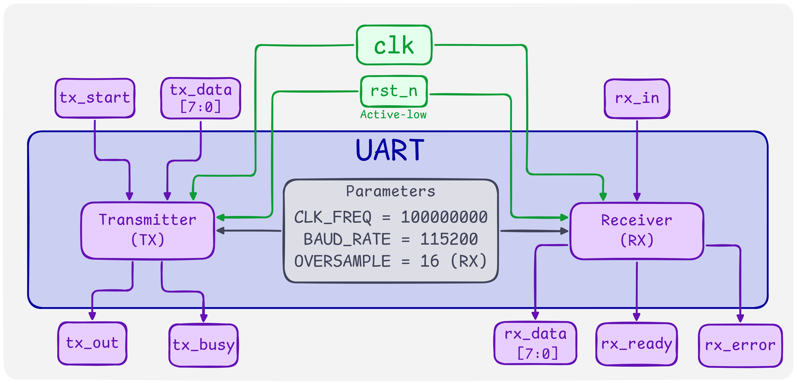
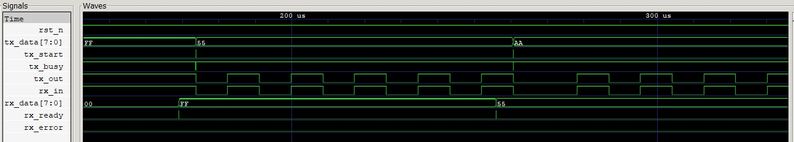

# UART TX/RX with a UVM Testbench

A UART transmitter and receiver in SystemVerilog (8N1, 115200 baud, 100 MHz clock, parameterized), with a 16x-oversampling receiver, verified in loopback (TX wired to RX) with a UVM environment: driver, sequencer, two monitors, a scoreboard with a reference model, and hand-coded coverage.

The Questa starter edition I use doesn't support `randomize()` or `covergroup`, so stimulus comes from `$urandom_range` and coverage is tracked with plain counters and bins in a `uvm_subscriber`. It's more manual than the standard flow, but it made me decide what "covered" means for a UART data path instead of letting a covergroup decide.

## Design

**TX.** A four-state FSM (IDLE, START, DATA, STOP). `tx_start` latches `tx_data`, and the frame goes out LSB first: one start bit, eight data bits, one stop bit, each lasting `CLK_FREQ / BAUD_RATE` clocks. `tx_busy` is decoded from the state, so it rises one clock after `tx_start` and falls when the stop bit ends.

**RX.** The input goes through a 2-FF synchronizer. When the line falls, an oversample counter starts and ticks every `CLK_FREQ / (BAUD_RATE x OVERSAMPLE)` clocks (54 with the defaults), 16 ticks per bit. The start bit is re-checked at tick 7 (mid-bit) to reject glitches. On entering DATA the tick count is cleared, so each data bit is sampled 16 ticks later, at its centre, and every following bit stays 16 ticks apart. The stop bit is checked at its centre: high produces a one-cycle `rx_ready` and updates `rx_data`, low produces a one-cycle `rx_error` and leaves `rx_data` untouched. Because the RX reports mid-stop-bit, `rx_ready` arrives about half a bit before the TX's `tx_busy` falls.

**Baud error.** 100 MHz / (115200 x 16) = 54.25, truncated to 54. The RX therefore times a bit as 864 clocks while the TX sends it in 868, about 0.46% off. Over a 10-bit frame the sample point drifts roughly 4 clocks against a margin of about 430, so this is harmless, and I kept the integer divider rather than adding a fractional one.

## Architecture

### RTL


### Testbench


The driver pulses `tx_start` with `tx_data`, and the TX serializes it into the RX. One monitor class is instantiated twice: the TX monitor records each byte sent, and the RX monitor records each byte received. The scoreboard's reference model is the transaction-level identity (bytes in equal bytes out, in order); the TX monitor pushes expected bytes into a queue and the RX monitor's bytes are compared against the front of it. Anything left in the queue at the end is reported as lost data.

## What was checked

| Behaviour | How it's checked | Where |
|---|---|---|
| Data integrity, TX to RX | Scoreboard compares every byte, in order | UVM, loopback |
| No lost or spurious bytes | Queue must be empty at the end; unexpected `rx_ready` is an error | UVM, loopback |
| Corner data values | `0x00`, `0xFF`, `0x55`, `0xAA`, `0x01`, `0x80` in a directed sequence | UVM, loopback |
| Every bit position | Per-bit 0 and 1 toggle bins | UVM, loopback |

## Result

```
UVM_INFO ... [COV] ---- Coverage Report ----
UVM_INFO ... [COV] Data Cover:     Covered
UVM_INFO ... [COV] Corner Values: 6/6
UVM_INFO ... [COV] Error: Not Found
UVM_INFO ... [COV] Total Coverage: 100.00%
UVM_INFO ... [SB] PASS=1000  FAIL=0

UVM_ERROR : 0    UVM_FATAL : 0

Error coverage is not reachable in loopback (the TX only sends clean frames).
```



## Bugs I ran into

**1. `rx_error` had the wrong polarity.** `rx_ready` and `rx_error` were both driven from `rx_sync_1`, so every good frame raised both flags and a bad frame raised neither. Fix: `rx_error <= ~rx_sync_1`.

**2. The RX sampled the first data bit at the wrong point.** `os_tick_count` kept free-running through START, so the first data bit was sampled at the *end* of the bit instead of the middle. Clearing the tick counter on the START-to-DATA transition put every sample at bit centre.

**3. A missing default in the TX's `always_comb` inferred a latch.** Without `next_state = current_state`, the state came out of reset as `x`, and `tx_busy` (which is decoded from state) was high before any `tx_start`.

**4. My first UVM driver returned after 15 ns instead of ~87 us.** It checked `tx_busy` before the TX had raised it (busy rises one clock after `tx_start`), so it assumed the TX was idle and moved on to the next item. The fix was making the driver wait for `tx_busy` to rise, then fall, and treating `x` as "not idle".

## File hierarchy

### RTL

| File | Role |
|---|---|
| [`uart_tx.sv`](rtl/uart_tx.sv) | Transmitter. Four-state FSM (IDLE, START, DATA, STOP) sending 8N1 frames, LSB first. `tx_start` latches `tx_data`, and one bit lasts `CLK_FREQ / BAUD_RATE` clocks. `tx_busy` is decoded from the state, so it rises one clock *after* `tx_start` and falls when the stop bit ends. |
| [`uart_rx.sv`](rtl/uart_rx.sv) | Receiver. Input goes through a 2-FF synchronizer, then a 16x oversample counter times the frame from the start-bit edge. The start bit is re-checked at mid-bit to reject glitches, data is sampled at each bit centre, and the stop bit is checked before `rx_ready` (valid frame) or `rx_error` (stop bit low) pulses for one cycle. `rx_data` only updates on a valid frame. |
| [`uart_top.sv`](rtl/uart_top.sv) | Wrapper that instantiates the TX and RX with shared clock, reset and parameters. TX and RX are independent here; the loopback wire from `tx_out` to `rx_in` is made in the testbench top, not in the RTL. |

### Testbench

| File | Role |
|---|---|
| [`uart_if.sv`](testbench/uart_if.sv) | Interface with two clocking blocks: `drv_cb` (drives `tx_data` and `tx_start`, reads `tx_busy`) and `mon_cb` (input-only, so a monitor can't accidentally drive the DUT). |
| [`uart_item.sv`](testbench/uart_item.sv) | Transaction object. Holds the data byte and an `error` flag; `inject_error` and `bit_scale` are stimulus knobs for a direct-drive mode and are unused in loopback. |
| [`uart_sequence.sv`](testbench/uart_sequence.sv) | Generates transactions with `$urandom_range` (no `randomize()` in my licence), with an option to send the directed corner values `0x00`, `0xFF`, `0x55`, `0xAA`, `0x01`, `0x80` first. |
| [`uart_driver.sv`](testbench/uart_driver.sv) | Turns an item into the TX handshake: waits for `tx_busy` low, pulses `tx_start` with `tx_data`, then waits for busy to rise and fall so each item covers a full frame. Waiting for the rise is what fixed an early bug where the driver returned after 15 ns. |
| [`uart_monitor.sv`](testbench/uart_monitor.sv) | One class used twice, with the role set through `config_db`. As a TX monitor it records a byte when `tx_start` is seen with `tx_busy` low; as an RX monitor it records one when `rx_ready` or `rx_error` fires. It emits one item per byte, not per clock. |
| [`uart_scoreboard.sv`](testbench/uart_scoreboard.sv) | Reference model and checker. The model is the transaction-level identity (bytes in equal bytes out, in order): TX-monitor items go into an expected queue, RX-monitor items are compared against its front, and anything left in the queue at the end is reported as lost data. |
| [`uart_coverage.sv`](testbench/uart_coverage.sv) | Manually coded coverage in a `uvm_subscriber` on the RX monitor, since `covergroup` isn't available. Tracks byte values seen, the six corner values, per-bit 0 and 1 toggles, and the error flag, and prints a report at the end of the run. |
| [`uart_agent.sv`](testbench/uart_agent.sv) | Bundles the driver, sequencer and both monitors (using kind). |
| [`uart_env.sv`](testbench/uart_env.sv) | Creates the agent, scoreboard and coverage collector, and connects both monitors to the scoreboard and the RX monitor to coverage. |
| [`uart_test.sv`](testbench/uart_test.sv) | Starts the sequence and holds the objection open long enough (a drain delay after the last item) for the final byte to reach the RX monitor. |
| [`uart_pkg.sv`](testbench/uart_pkg.sv) | Package that includes the testbench classes in dependency order. The interface is compiled separately, before the package. |
| [`uart_tb_top.sv`](testbench/uart_tb_top.sv) | Top-level module: clock and reset generation, the DUT instance, the loopback `assign` from `tx_out` to `rx_in`, and the `config_db` call that hands the virtual interface to the testbench before `run_test`. |

## Compilation & Simulation

```bash
python run.py
```
